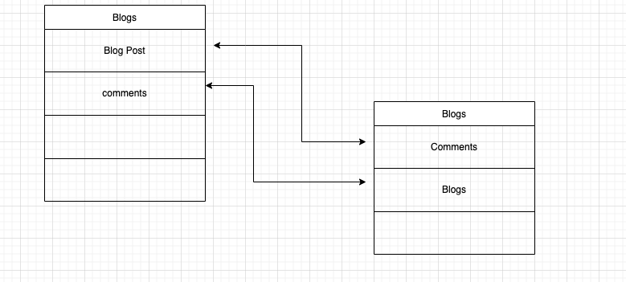
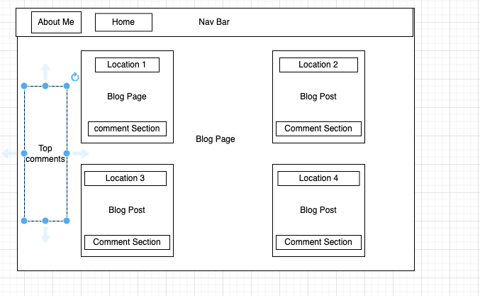
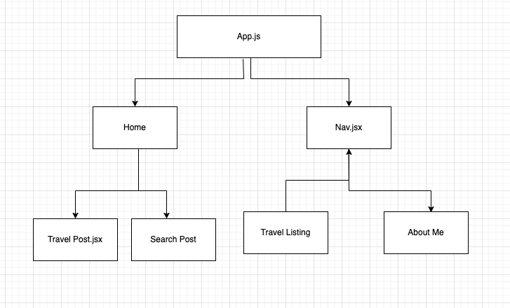
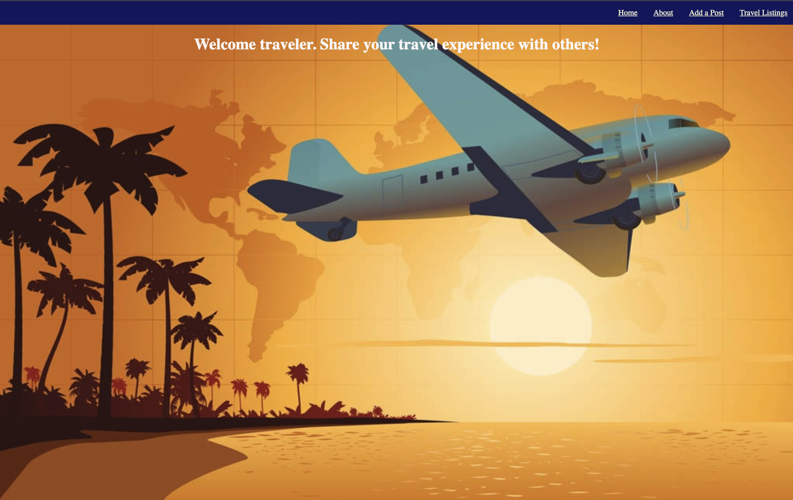
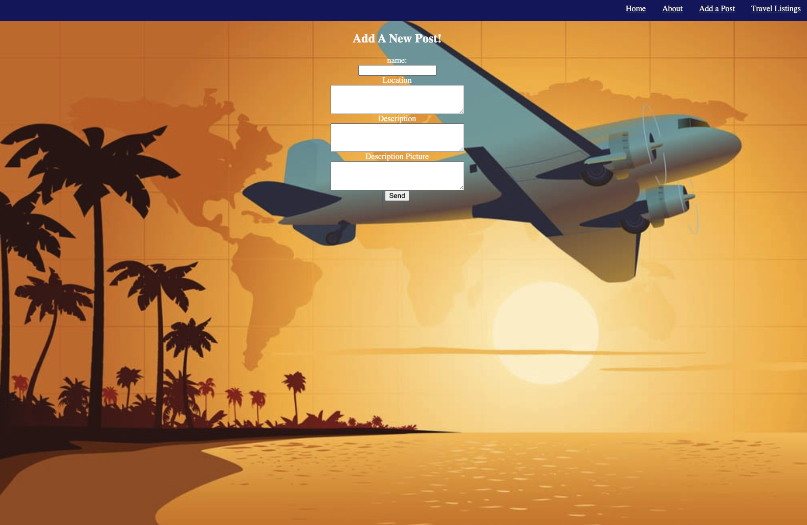
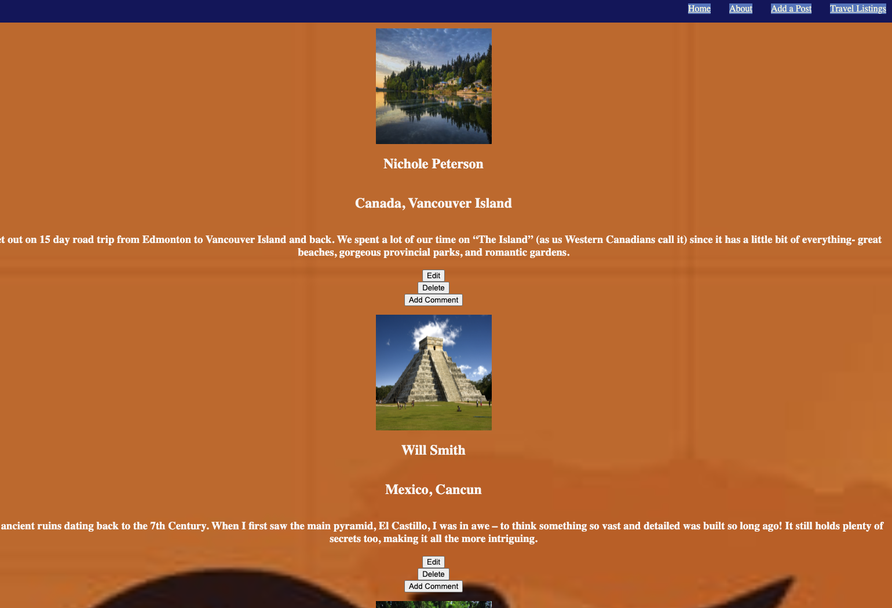

#### [Travel Experience Blog website](http://)

# Travel Experience Blog website

## Date: 2/28/2023

### By: Clifton Lucas

#### [GitHub](https://github.com/Cliftonlucas1?tab=repositories) | [LinkedIn](https://www.linkedin.com/in/clifton-lucas-b80540121/) | [trello](https://trello.com/b/bwJ6O5za/travel-blog)

---

#### The objective of this blog is to share information about places you have travel.This information would include the good,bad and in between experience you had at those locations. You will be able to create your own post as well as read others post on places they traveled and their experience.

#### Share your experience about trip while others get to post and comments on your experience

#### The Motivation for this project was to create my first full stack project and utilize the Technologies I learned and grow as a developer.

### **_Technologies Used_**

- HTML
- Javascript
- CSS
- React
- MONGODB
- EXPRESS

---

### **_Future Updates_**

coming soon!

---

### **_Credits_**

#### background Images:

#### Background Picture: https://duckduckgo.com/

##### Markdown Cheatsheet: [GitHub](https://

---
